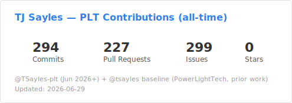

# Hi, I'm TJ 👋

**Work profile for [PowerLight Technologies](https://www.powerlighttechnologies.com)**
— laser-based wireless power transmission systems.

> 🔗 Personal / open-source work: **[@tsayles](https://github.com/tsayles)**

---

## 🔭 What I work on at PLT

- 🏗️ PLM relaunch — Duro HUB migration tooling, SolidWorks data
  extraction, Python automation (`duro-config`)
- 📡 Field data management — S3 sync CLI + PyQt6 desktop GUI for
  Denali laser test session uploads (`denali-s3-sync`)
- 🌡️ PV receiver thermal modeling — steady-state & transient analysis
  for laser-to-UAV power beaming (`rx_thermal_python`)
- 🔬 PV cell characterization — EL/DIV/LIV test automation and Qt6
  Single Cell Test Stand (`PV_Testing`)
- 🔒 CMMC 2.0 Level 2 compliance program management
  (`cmmc-l2-compliance`)
- 🖥️ LAN monitoring — containerized ntopng/InfluxDB/Grafana stack on
  Proxmox (`yams-lan-monitoring`)
- 🤖 Custom Copilot agent development & engineering workflow tooling
  (`.github-private`)

---

## 🛠️ Tech I use regularly

---

## 📦 Organization

All PLT repositories live under the
**[PowerLightTech](https://github.com/PowerLightTech)** organization.

---

## 📊 GitHub Stats

> Combines [@TSayles-plt](https://github.com/TSayles-plt) (Jun 2026+)
> and [@tsayles](https://github.com/tsayles) (PowerLightTech org only).
> Updated weekly via GitHub Actions.

---

*Personal projects & open-source contributions →
**[@tsayles](https://github.com/tsayles)***
